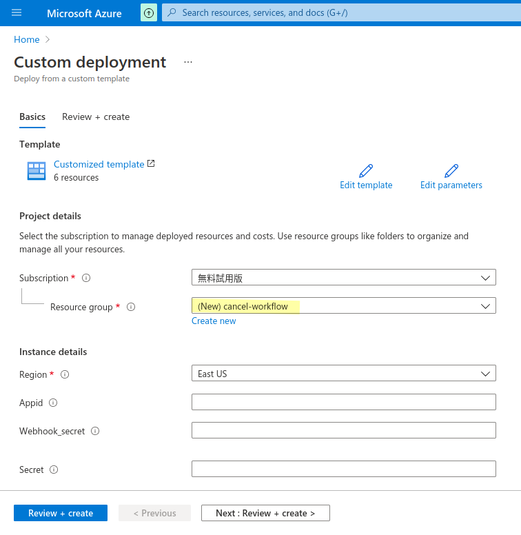
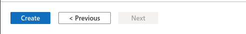
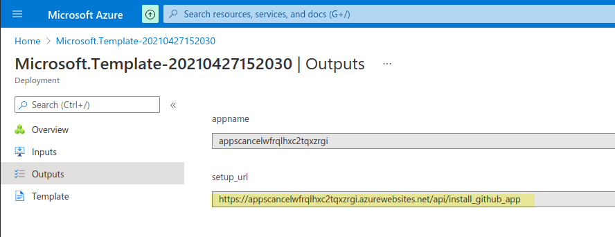
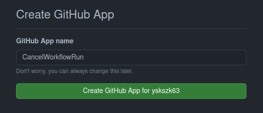
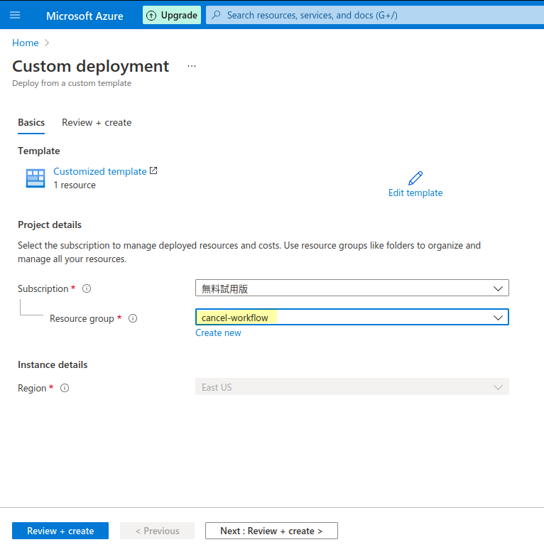
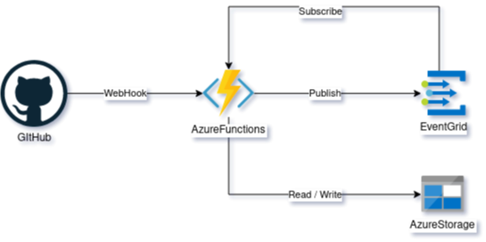
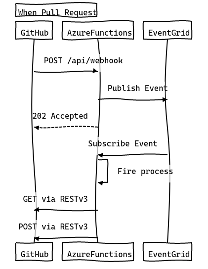
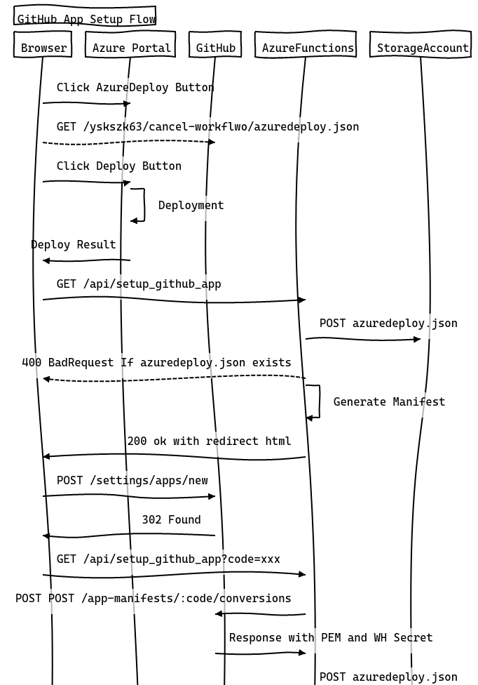
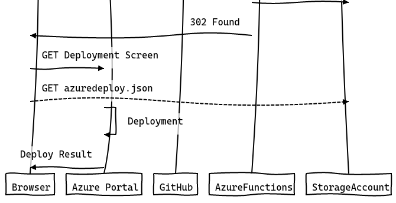

# Cancel workflow run GitHub Apps

Cancel workflow run BOT.
Cancel workflow run If Pull request contains new workflow, and which trigger pull request.

The main purpose is to repel miners.

## Install

Sorry, Not publish this GitHub Apps.
Because I don't have the money to get the backend working.

## GitHub Apps Setup flow (For Self hosted)

### Prerequisites

- GitHub Account.
- Azure Subscription.
    + Needs Contributor role

### 1. Click Deploy to Azure button

### 2. Fill below And click Create

- Resource group ... Please specify the deployment destination of resources.
- Region ... Please specify the deployment region of resources.
- AppId ... NO NEED TO FILL. (fill after GitHub Apps created.)
- Webhook\_secret ... NO NEED TO FILL. (fill after GitHub Apps created.)
- Secret ... NO NEED TO FILL. (fill after GitHub Apps created.)

### 3. After deployed. Open `setup_url`

### 4. Create GitHub Apps.

After `setup_url` opened. GitHub App Creation Site will be displayed.
Fill GitHub App name, And click Create GitHub App Button.

### 5. Apply GitHub App Parameters.

After click Create GitHub App Button. Azure template deploy screen displan again.
Select Resource Group which fill in `2. Fill below And click Create`.

### 6. Done.

You can now install it. 

## Using resources.

- Azure Functions
    + Linux consumption plan
    + (Backend language is go)
- Azure Storage
    + Azure Functions Requirements
- Azure App Insights
    + For Azure Functions monitoring
- Event Grid
    + Kick workflow cancel job for GitHub App webhook hooked Asynchronously.

## Details

### Trigger `workflow_run` flow

### Setup GitHub App flow

It is drawn in [yskszk63/seqdia](https://github.com/yskszk63/seqdia).

## LICENSE

[MIT](LICENSE)
